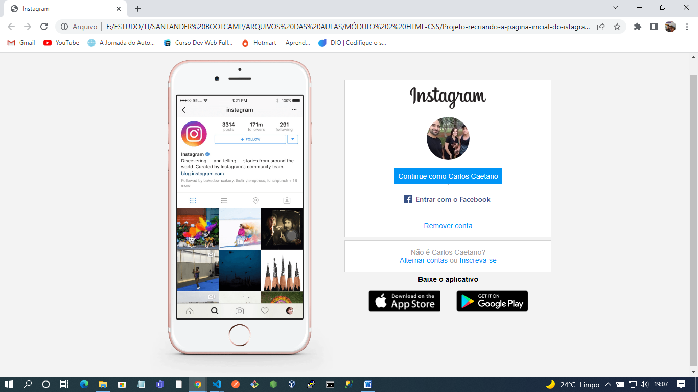

<h1 align="center"> Recriando a pagina inicial do instagram </h1>

##

Este é um projeto feito pela <b>Digital Innovation One (DIO)</b> no Bootcamp Santander Bootcamp Fullstack Developer e adaptado por mim.

 
 Neste projeto tive acesso à lições sobre HTML5 e CSS3. 

<h2>Principais tópicos abordados</h2>
<ul align="left">
  <li>hierarquia de tags</li>
  <li>flex-layout</li>
  <li>grid-layout</li>
  <li>css tricks</li>
</ul>

